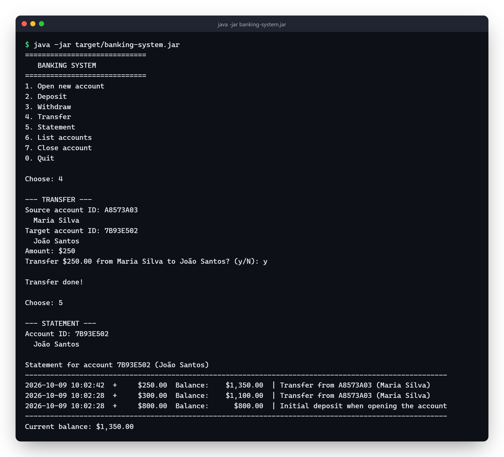

# Banking System


A simple bank that runs in the terminal, written in Java with SQLite (JDBC).

You can open an account, deposit, withdraw, transfer between accounts, see the statement and close an account. The data is saved to a `bank.db` file, so it's still there when you open the program again.

## Running

You need JDK 17 and Maven.

```bash
mvn package
java -jar target/banking-system.jar
```

The first time it runs, it creates two sample accounts for you to play with.

To run only the tests:

```bash
mvn test
```

## What it looks like

A transfer and the statement of the person who got it:



Right after you type the ID, the program shows whose account it is. If you get the ID wrong, you find out right away, not after typing the amount. And the transfer only happens after you confirm seeing the name of who's getting the money.

On Windows, if accented names look weird in the terminal, run `chcp 65001` first.

## Some decisions

- I used `BigDecimal` for money instead of `double`, because `double` has rounding errors (like `0.1 + 0.2` being `0.30000000000000004`).
- The transfer runs inside a database transaction: either both accounts are updated, or neither is.
- Each account is tied to a CPF (the Brazilian taxpayer ID). It's validated by its check digits, and you can't open two accounts with the same CPF.
- When typing amounts, you can use `1500`, `1500.50` or `1,500.50`.

## Structure

I split it into layers:

```
Main (menu) -> BankService (rules) -> BankRepository (SQL) -> SQLite
```

```
src/main/java/bank/
  Main.java
  model/        Account, Transaction, Money
  repository/   BankRepository
  service/      BankService, Cpf
src/test/java/bank/
```
